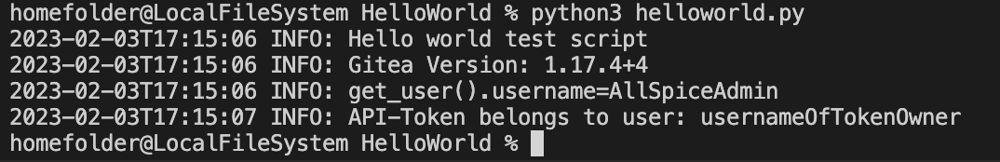

# helloworld.py

## Summary
A simple script to sanity check your connection to an AllSpice server. 
Also a good tutorial on basic python-allspice api usage

## Usage
From the command line, create two environmental variables
This example uses bash

```
export ALLSPICE_URL="https://hub.allspice.io"

export ALLSPICE_ACCESS_TOKEN="your-access-token"

```

If you need help, check out our tutorial on [how to create an AllSpice access token](https://allspice.document360.io/docs/how-to-create-an-allspice-authentication-application-access-token).

## Output

A photo of the bash output


"usernameOfTokenOwner" will be the username that owns the ALLSPICE_ACCESS_TOKEN provided.
```
homefolder@LocalFileSystem HelloWorld % python3 helloworld.py
2023-02-03T17:22:01 INFO: Hello world test script
2023-02-03T17:22:01 INFO: Gitea Version: 1.17.4+4
2023-02-03T17:22:01 INFO: API-Token belongs to user: usernameOfTokenOwner
homefolder@LocalFileSystem HelloWorld % 
```
